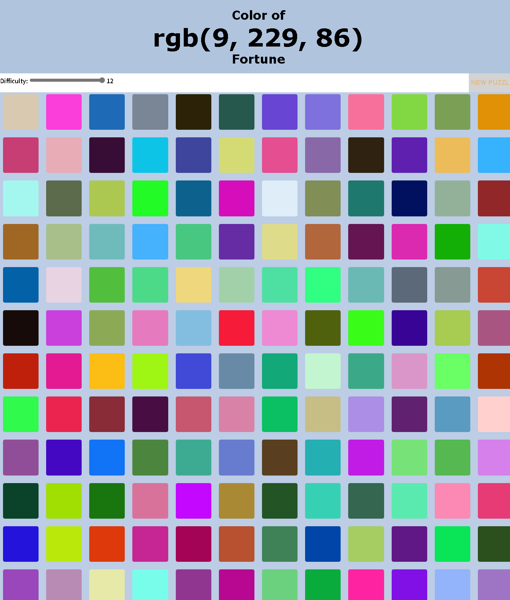

### Hosted by:

# Side Project —— Colour Of Fortune
- 这是一个我在高中生涯workshop学习的其中一份企划。
- 当初做完的时候，他只有一个难度，并且没有responsive功能。
- 因此经过了几个月的改造以及痛苦的挣扎后，终于使用了一种用slider的方式来动态改变游戏的难度。

# 如何游玩：
### 
- 左边的slider可以选择难度，难度的系数为 n²。
  - 简单来说，如果你选择难度为6，你就会有6² = 36个不同颜色的正方形需要辨认。
  - 最高难度为144个正方形，最低为4个。
  - 目前不打算装计分以及动态系统，因为他只是一个高中小企划而已。

# 目前进度：
- Index：
